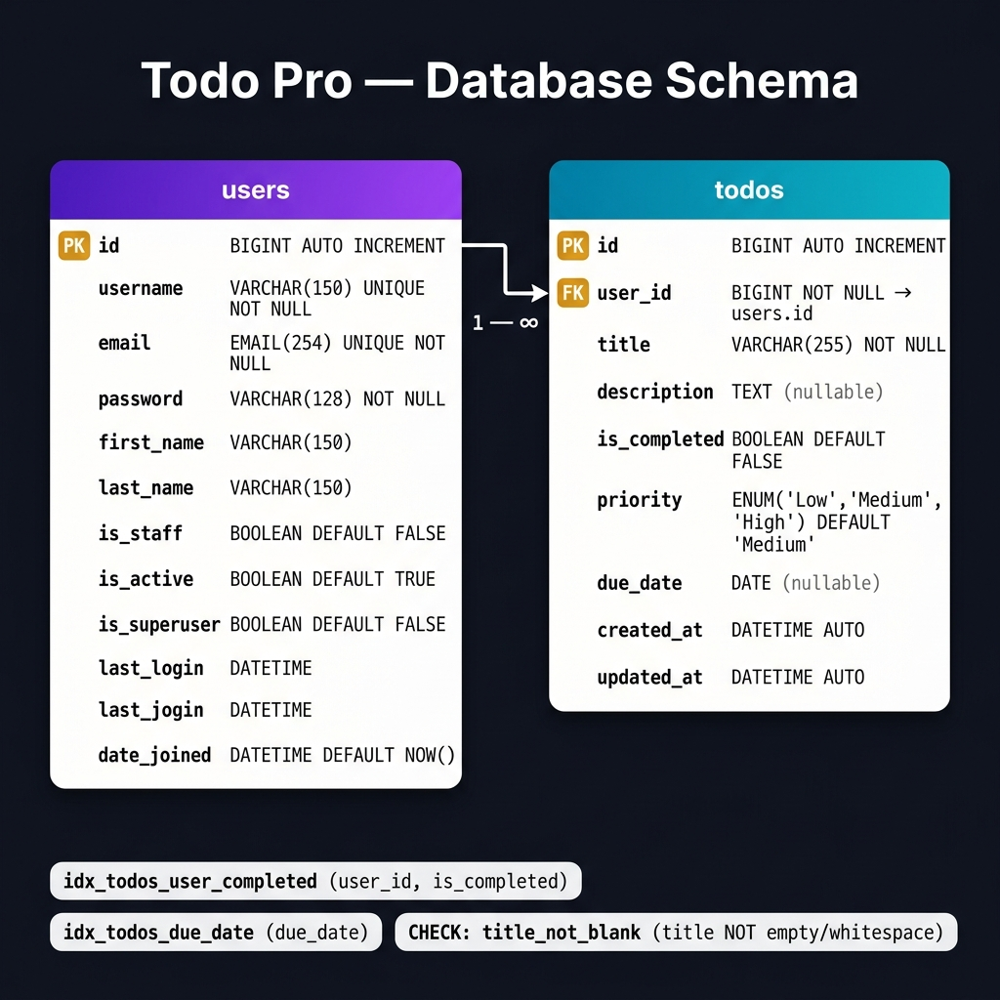

# 🗄️ Todo Pro — Database Schema



---

## Overview

This project uses **SQLite** (development) via **Django ORM**. The schema consists of two core tables:

| Table   | Description                              |
|---------|------------------------------------------|
| `users` | Custom user model extending Django's `AbstractUser` |
| `todos` | Todo items owned by a user               |

---

## Tables

### 🟣 `users`

> Custom user model (`AbstractUser`) — table: `users`

| Column        | Type              | Constraints                        |
|---------------|-------------------|------------------------------------|
| `id`          | `BIGINT`          | PK, Auto Increment                 |
| `username`    | `VARCHAR(150)`    | UNIQUE, NOT NULL                   |
| `email`       | `EMAIL(254)`      | UNIQUE, NOT NULL                   |
| `password`    | `VARCHAR(128)`    | NOT NULL                           |
| `first_name`  | `VARCHAR(150)`    | Optional                           |
| `last_name`   | `VARCHAR(150)`    | Optional                           |
| `is_staff`    | `BOOLEAN`         | DEFAULT `FALSE`                    |
| `is_active`   | `BOOLEAN`         | DEFAULT `TRUE`                     |
| `is_superuser`| `BOOLEAN`         | DEFAULT `FALSE`                    |
| `last_login`  | `DATETIME`        | Nullable                           |
| `date_joined` | `DATETIME`        | DEFAULT `NOW()`                    |
| `groups`      | M2M → `auth.Group`| Django permission groups           |
| `user_permissions` | M2M → `auth.Permission` | Django per-user permissions |

---

### 🔵 `todos`

> Todo item model — table: `todos`

| Column         | Type                              | Constraints                     |
|----------------|-----------------------------------|---------------------------------|
| `id`           | `BIGINT`                          | PK, Auto Increment              |
| `user_id`      | `BIGINT`                          | FK → `users.id`, NOT NULL, CASCADE DELETE |
| `title`        | `VARCHAR(255)`                    | NOT NULL, CHECK: not blank/whitespace |
| `description`  | `TEXT`                            | Nullable                        |
| `is_completed` | `BOOLEAN`                         | DEFAULT `FALSE`                 |
| `priority`     | `ENUM('Low', 'Medium', 'High')`   | DEFAULT `'Medium'`              |
| `due_date`     | `DATE`                            | Nullable                        |
| `created_at`   | `DATETIME`                        | Auto-set on create              |
| `updated_at`   | `DATETIME`                        | Auto-set on update              |

---

## 🔗 Relationships

```
users (1) ──────────────── (∞) todos
         user.id = todos.user_id
         ON DELETE CASCADE
```

- A **User** can have **many Todos** (One-to-Many).
- Deleting a User **cascades** and deletes all their Todos.

---

## 📑 Indexes

| Index Name                  | Table   | Columns                  | Purpose                              |
|-----------------------------|---------|--------------------------|--------------------------------------|
| `idx_todos_user_completed`  | `todos` | `(user_id, is_completed)`| Fast filtering of todos by user & completion status |
| `idx_todos_due_date`        | `todos` | `(due_date)`             | Efficient sorting/filtering by due date |
| *(auto)*                    | `todos` | `(user_id)`              | Auto-created by Django for FK        |

---

## ✅ Constraints

| Constraint Name   | Table   | Type    | Rule                                        |
|-------------------|---------|---------|---------------------------------------------|
| `title_not_blank` | `todos` | CHECK   | `title` must not be empty or whitespace-only |
| `email` unique    | `users` | UNIQUE  | No two users can share the same email        |
| `username` unique | `users` | UNIQUE  | No two users can share the same username     |

---

## ⚙️ Priority Choices

The `priority` field on the `todos` table is a string enum with three allowed values:

| Value    | Label    |
|----------|----------|
| `Low`    | Low      |
| `Medium` | Medium   |
| `High`   | High     |

---

## 🛠️ Tech Stack

| Layer    | Technology                          |
|----------|-------------------------------------|
| Backend  | Django 6.x + Django REST Framework  |
| Database | SQLite (dev) / PostgreSQL (prod-ready) |
| Auth     | JWT (via `rest_framework_simplejwt`) |
| Frontend | React + Vite                        |
